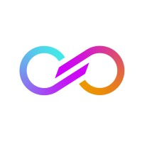
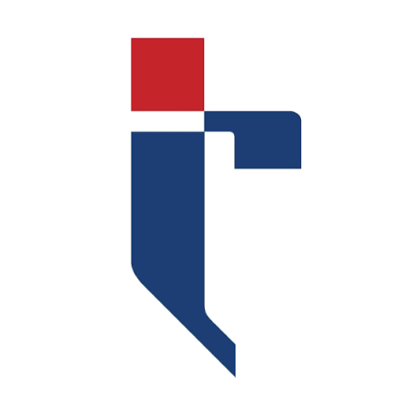

# 💫 Hi! I'm Kavya Raval.

🎓 **Computer Science Student**  
@ Toronto Metropolitan University

 

---

# 👩‍💻 About Me

- 📊 Exploring **Data Analytics, AI, Business Intelligence, and Responsible AI**
- 🤖 Passionate about **LLM applications, prompt engineering, and AI-assisted innovation**
- 🧠 Blend technical problem-solving with **creative thinking, research, and analytical storytelling**
- ✍️ Strong interest in **writing, communication, and translating complex ideas into meaningful insights**
- 🐍 Experienced with **Python, Pandas, Excel, Power BI, Tableau, and data workflows**
- 🌱 Continuously learning and building solutions at the intersection of technology and impact

---

# 💼 Experience

### 📊 Director of Data Science  
**Metropolitan Data Science Association**  
*May 2026 – Present*

- Develop technical learning materials and workshops covering Python, Power BI, Excel, and Tableau
- Mentor students in analytical thinking, technical problem-solving, and data concepts
- Collaborate on curriculum planning and knowledge-sharing initiatives

 

### 🔬 Student Researcher  
**New York Academy of Sciences**  
*Sep 2024 – Jun 2025*

- Researched ethical AI, algorithmic bias, transparency, and trust in automated systems
- Synthesized literature and behavioral research into structured deliverables
- Collaborated with an international research team across 4+ countries

 

### 💻 Information Technology Intern  
**Transformers and Rectifiers India Ltd.**  
*May 2024 – Jul 2024*

- Digitalized budget proposal workflows through ERP software integration (Infor LN)
- Prepared structured reporting to validate operational data against business targets
- Improved accessibility and organization of operational information

 

---

# 🏆 Leadership

- 👩‍💻 **Computer Science Program Representative**  
  Women in Science — Toronto Metropolitan University

- 🎤 **BYTE Ambassador**  
  Toronto Metropolitan University

- 🌱 **Youth Specialist**  
  Live to Inspire Foundation

- 👑 **Vice Head Girl**  
  Lalji Mehrotra Lions School

---
# 🚀 Featured Projects

 

AI-powered financial intelligence platform using LLMs to analyze expenses and generate actionable insights.

  

 

LLM-powered ATS scanner that evaluates resumes and provides personalized improvement suggestions.

  

 

Social media analytics pipeline transforming 300K+ data points into meaningful trends and visualizations.

  

 

Interactive Tableau dashboard exploring AI job market trends and career insights.

---

# 💻 Tech Stack

## 🧠 Programming Languages

---

## 📊 Data Analytics & Visualization

---

## ☁️ Development Tools

---

## 🌐 Productivity & Workspace

---

## 🎨 Design & Creative Tools

---

# 🌐 Connect With Me

✨ *Always learning. Always building. Always exploring AI & data.*
